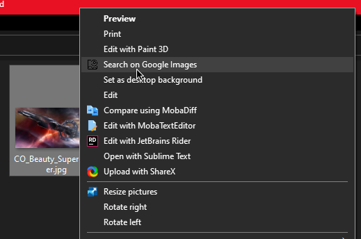

# GoogleImageShell

Search Google Images from the comfort of Windows Explorer!

## Requirements

- Windows 7 or above
- [.NET 4.8.1 Runtime](https://dotnet.microsoft.com/en-us/download/dotnet-framework/net481)

## Installation

Install the program by running the executable and clicking 'Install'.
To install for all users, run the program as an administrator and check
the "Install/uninstall for all users" box.

To uninstall, follow the same steps but click 'Uninstall'. If you
installed the program for all users, you must also uninstall it for
all users.

**Note**: Do not delete, move, or rename the executable file before
uninstalling the program; otherwise the shortcut entry will stop
functioning!

## Supported image formats

- JPG
- GIF
- PNG
- BMP

## License

## In-Application Icons ##

In-Application Icons
By [Icons8](https://icons8.com)

## Distribution ##

Distributed under the [MIT License](http://opensource.org/licenses/MIT).

This program is not affiliated with or endorsed by Google.
